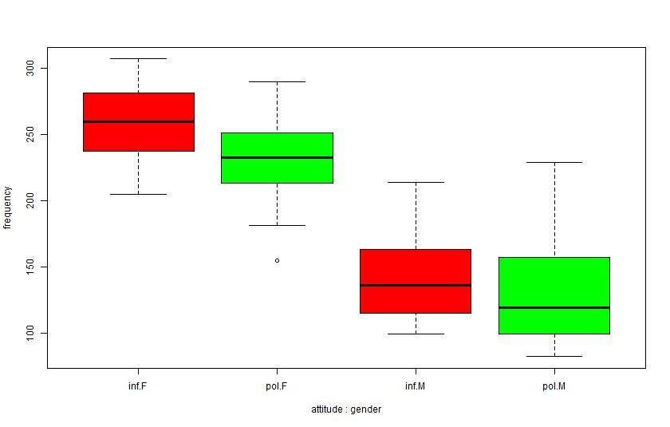
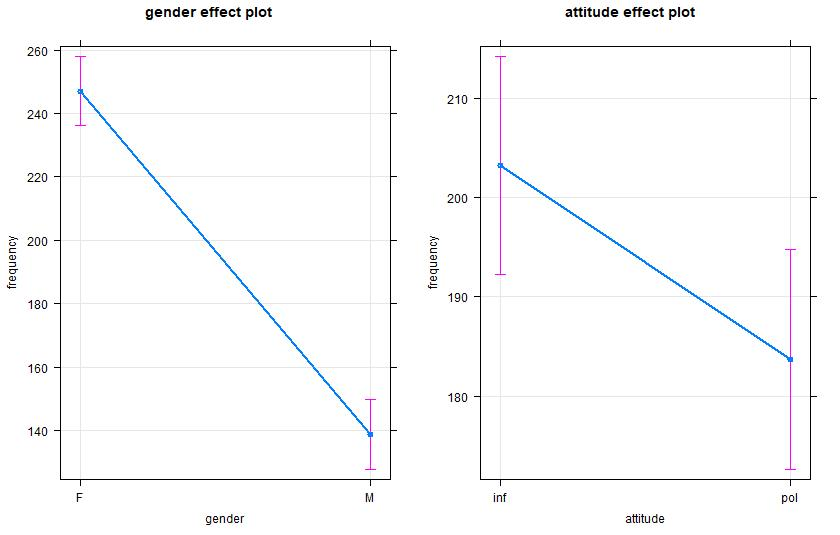
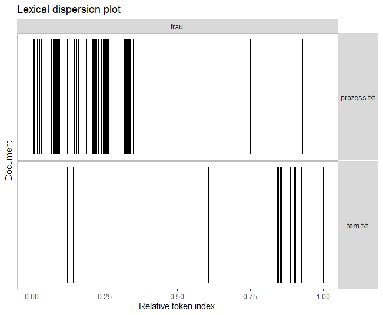
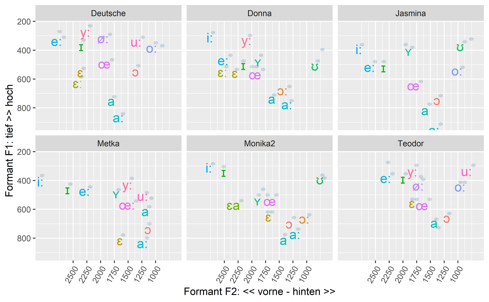
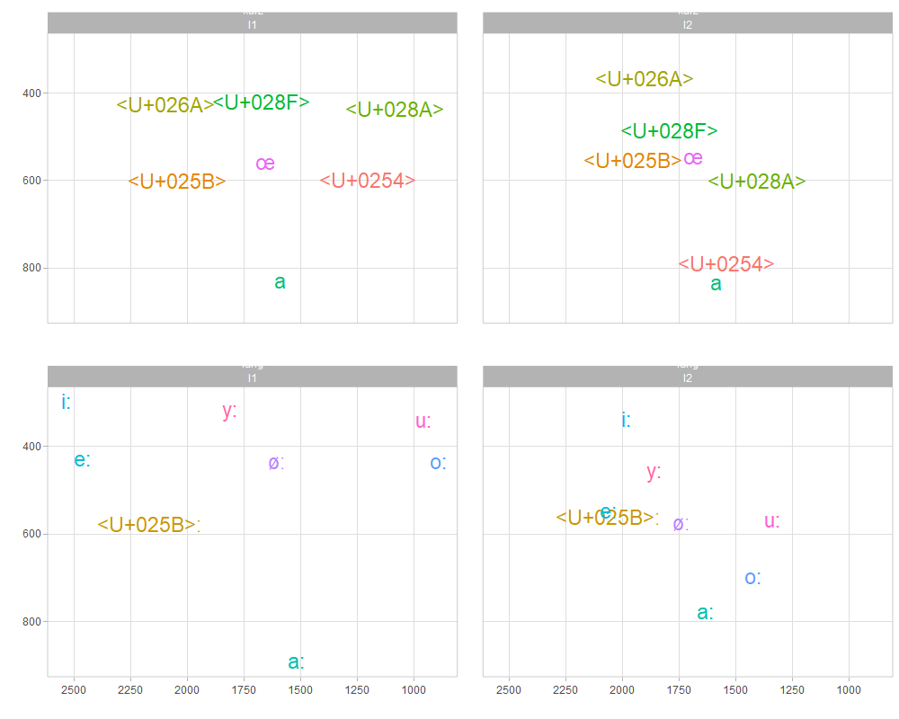

# tpetric7.github.io

## RAJ 2021, Exercises with R/RStudio: 

### File Management 
- [Download, unzip, list & dir](docs/download_unzip_list_dir.md)
- [Open & Save](docs/Odpiranje_in_shranjevanje.md)

### Statistics
* Chi square test
- [Comments of Teacher, V1](docs/kommentare_chisq.md)
- [Comments of Teacher, V2](docs/kommentare_chisq.R)
- [Plural Markers, V1](docs/plural_chisq1.md)
- [Plural Markers, V2](docs/plural_chisq2.md)
- [Modal verb constructions](docs/Modalkonstruktionen_chisq3.md)

* t test
- [Politeness and Pitch](docs/t_preskus.R)

* Ordinary least squares Regression
- [Politeness and Pitch, V1](docs/politeness.md)
- [Politeness and Pitch, V2](docs/Politeness.R)

### Excel functions compared to R tidyverse 
- [xlookup](docs/Excel_vs_R.md)

### Basic NLP tasks
- [Word and character count, Sentence length](docs/Textzerlegung.md)
- [Novel comparison](docs/Sawyer_Prozess.md)
- [Novel original and translation](docs/tom_vs_tom.md)
- [Using regular expressions](docs/Regex_in_quanteda.md)
- [Wordformation suffixes](docs/Romane_Suffixe.md)
- [Wordformation suffixes](Romane_Suffixe.ipynb)
- [Letter frequency, word length, syllables](docs/Letter_frequency.md)
- Sentiment Viewer [html](docs/sentiment_prozess_tom.html)

### Acoustic Phonetics
* [Vowel Formant Plots](docs/S03_Vokalformanten_Dauer.md)

#### OLS Regression

``` r
m <- lm(frequency ~ gender + attitude, data=polite)
summary(m)
```

``` r
library(effects)
allEffects(m)
plot(allEffects(m), multiline=TRUE, grid=TRUE, rug=FALSE, as.table=TRUE)
```





#### NLP

``` r
library(readtext)
library(quanteda)
library(quanteda.textplots)

txt = readtext("data/books/*.txt", encoding = "UTF-8")
romane = corpus(txt)
kwic_frau = kwic(romane, pattern = "frau")
textplot_xray(kwic_frau)
```



#### Vowel formants in L1 / L2 German

 


