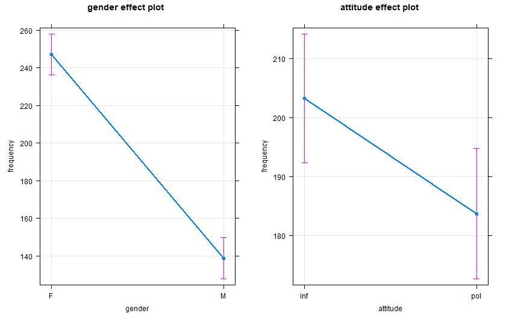

# tpetric7.github.io

## RAJ 2021, Exercises with R/RStudio:

- Chi square test
- t test
- Ordinary least squares Regression
- Excel functions (here: xlookup) compared to R 
- basics of NLP (quanteda)

### OLS Regression

``` r
m <- lm(frequency ~ gender + attitude, data=polite)
summary(m)
```

``` r
library(effects)
allEffects(m)
plot(allEffects(m), multiline=TRUE, grid=TRUE, rug=FALSE, as.table=TRUE)
```





### NLP

``` r
library(readtext)
library(quanteda)
library(quanteda.textplots

txt = readtext("data/books/*.txt", encoding = "UTF-8")
romane = corpus(txt)
kwic_frau = kwic(corpus, pattern = "frau")
textplot_xray(kwic_frau)
```
