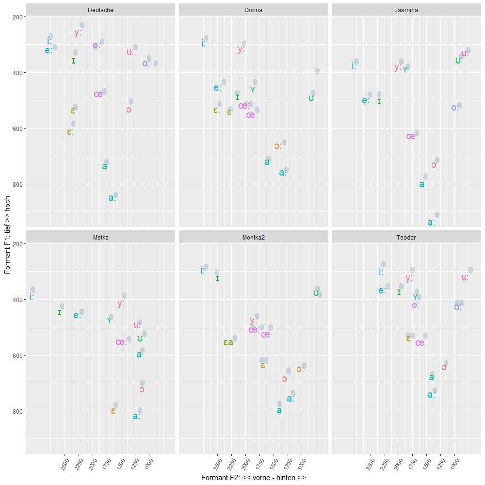
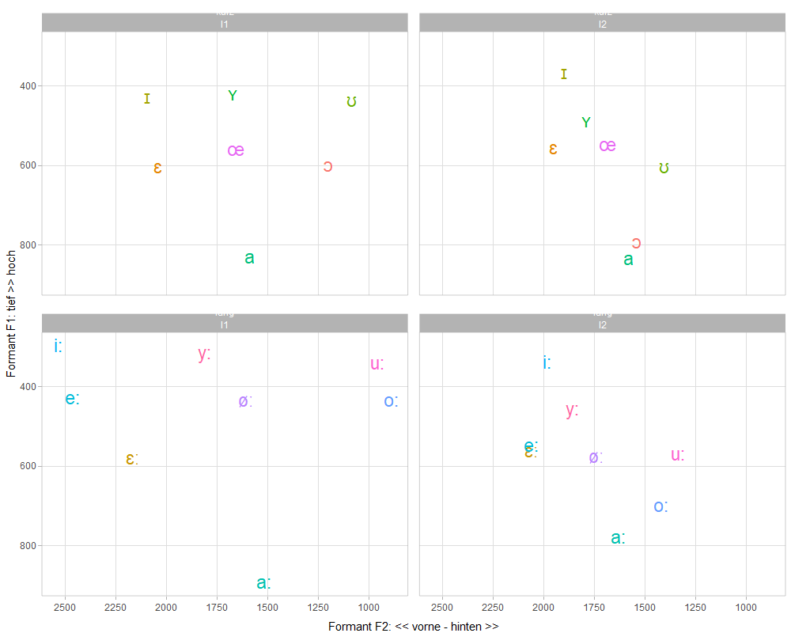

# tpetric7.github.io

## RAJ 2021, Exercises with R/RStudio:

* [File Management: Download, unzip, list & dir](docs/download_unzip_list_dir.md)
- [File Management: Open & Save](docs/Odpiranje_in_shranjevanje.md)

* [Chi square test: Comments of Teacher, V1](docs/kommentare_chisq.md)
- [Chi square test: Comments of Teacher, V2](docs/kommentare_chisq.R)
- [Chi square test: Plural Markers, V1](docs/plural_chisq1.md)
- [Chi square test: Plural Markers, V2](docs/plural_chisq2.md)
- [Chi square test: Modal verb constructions](docs/Modalkonstruktionen_chisq3.md)

* [t test: politeness](docs/t_preskus.md)

* [Ordinary least squares Regression: Politeness and Pitch, V1](docs/politeness.md)
- [Ordinary least squares Regression: Politeness and Pitch, V2](docs/Politeness.R)

* [Excel functions compared to R tidyverse: xlookup](docs/Excel_vs_R.md)

* [Basic NLP tasks using quanteda](docs/Sawyer_Prozess.md)
- [NLP: Using regular expressions](docs/Regex_in_quanteda.md)

* [Vowel Formant Plots](docs/S03_Vokalformanten_Dauer.md)

### OLS Regression

``` r
m <- lm(frequency ~ gender + attitude, data=polite)
summary(m)
```

``` r
library(effects)
allEffects(m)
plot(allEffects(m), multiline=TRUE, grid=TRUE, rug=FALSE, as.table=TRUE)
```


### NLP

``` r
library(readtext)
library(quanteda)
library(quanteda.textplots)

txt = readtext("data/books/*.txt", encoding = "UTF-8")
romane = corpus(txt)
kwic_frau = kwic(corpus, pattern = "frau")
textplot_xray(kwic_frau)
```


### Vowel formants in L1 / L2 German

 
