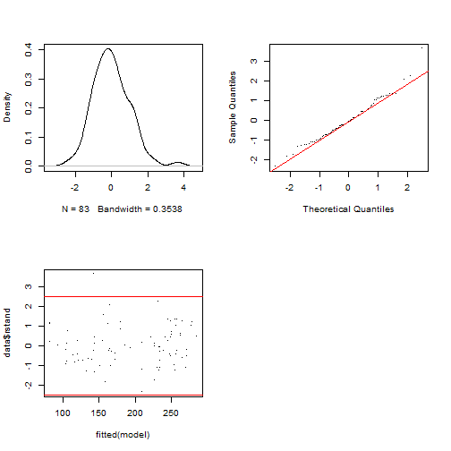
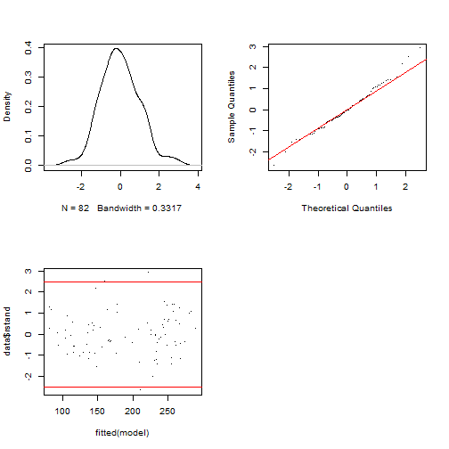

# Politeness data (B. Winter tutorial)

## 1. Data

```{r}
# Politeness data (B. Winter tutorial)

# LOAD
rm(list=ls(all=TRUE)) # clear memory
polite <- read.csv("data/politeness_data.csv", dec=".")

attach(polite)
```

```
## The following object is masked from package:datasets:
## 
##     attitude
```

```{r}
head(polite)
```

```
##   subject gender scenario attitude frequency
## 1      F1      F        1      pol     213.3
## 2      F1      F        1      inf     204.5
## 3      F1      F        2      pol     285.1
## 4      F1      F        2      inf     259.7
## 5      F1      F        3      pol     203.9
## 6      F1      F        3      inf     286.9
```

## 2. Variable setup

```{r}
polite$frequency = as.numeric(polite$frequency)
polite$scenario = as.factor(polite$scenario)
polite$subject = as.factor(polite$subject)
polite$gender = as.factor(polite$gender)
polite$attitude = as.factor(polite$attitude)

attach(polite)
```

```
## The following objects are masked from polite (pos = 3):
## 
##     attitude, frequency, gender, scenario, subject
## 
## The following object is masked from package:datasets:
## 
##     attitude
```


## 3. Contrast Setting

```{r}
# In this session we use contr. sum contrasts
options(contrasts=c('contr.sum', 'contr.poly'))
options("contrasts")
```

```
## $contrasts
## [1] "contr.sum"  "contr.poly"
```

```{r}
# To reset default settings run: 
options(contrasts=c('contr.treatment', 'contr.poly')) 
# (all afex functions should be unaffected by this)

# # Setting contrasts of chosen variables only
# contrasts(polite$attitude) <- contr.treatment(2, base = 1)

```

## 4. Exploration

```{r}

boxplot(frequency ~ attitude*gender, 
        col=c("red","green"), polite) 
```


```{r}
# 1. Open jpeg file
jpeg("pictures/politeness_boxplot.jpg", 
     width = 840, height = 535)
# 2. Create the plot
boxplot(frequency ~ attitude*gender, 
        col=c("red","green"), polite) 
# 3. Close the file
dev.off()
```

```
## png 
##   2
```

```{r}
# Open a pdf file
pdf("pictures/politeness_boxplot.pdf") 
# 2. Create a plot
boxplot(frequency ~ attitude*gender, 
        col=c("red","green"), polite) 
# Close the pdf file
dev.off() 
```

```
## png 
##   2
```


## 5. OLS Regression

```{r}
################
# OLS Regression
################

# Inspect relationships between pairs of variables
library(MASS)
```

```
## 
## Attaching package: 'MASS'
```

```
## The following object is masked from 'package:dplyr':
## 
##     select
```

```{r}
pairs.panels(polite[c(2,4,5)])
```

```
## Error in pairs.panels(polite[c(2, 4, 5)]): could not find function "pairs.panels"
```

```{r}
# model 1
m <- lm(frequency ~ gender + attitude + subject + scenario, data=polite)
summary(m)
```

```
## 
## Call:
## lm(formula = frequency ~ gender + attitude + subject + scenario, 
##     data = polite)
## 
## Residuals:
##     Min      1Q  Median      3Q     Max 
## -53.673 -16.686   1.039  12.027  86.630 
## 
## Coefficients: (1 not defined because of singularities)
##             Estimate Std. Error t value Pr(>|t|)    
## (Intercept)  225.150     10.020  22.470  < 2e-16 ***
## genderM     -129.857      9.606 -13.518  < 2e-16 ***
## attitudepol  -19.794      5.585  -3.544 0.000707 ***
## subjectF2     26.150      9.606   2.722 0.008179 ** 
## subjectF3     18.700      9.606   1.947 0.055592 .  
## subjectM3     66.800      9.606   6.954 1.52e-09 ***
## subjectM4     41.854      9.807   4.268 6.09e-05 ***
## subjectM7         NA         NA      NA       NA    
## scenario2     25.017     10.376   2.411 0.018537 *  
## scenario3     31.025     10.376   2.990 0.003847 ** 
## scenario4     42.508     10.376   4.097 0.000111 ***
## scenario5     14.408     10.376   1.389 0.169351    
## scenario6      1.405     10.629   0.132 0.895227    
## scenario7      3.117     10.376   0.300 0.764783    
## ---
## Signif. codes:  0 '***' 0.001 '**' 0.01 '*' 0.05 '.' 0.1 ' ' 1
## 
## Residual standard error: 25.42 on 70 degrees of freedom
##   (1 observation deleted due to missingness)
## Multiple R-squared:  0.8716,	Adjusted R-squared:  0.8496 
## F-statistic: 39.61 on 12 and 70 DF,  p-value: < 2.2e-16
```

```{r}
# model 2
m <- lm(frequency ~ gender + attitude, data=polite)
summary(m)
```

```
## 
## Call:
## lm(formula = frequency ~ gender + attitude, data = polite)
## 
## Residuals:
##     Min      1Q  Median      3Q     Max 
## -82.409 -26.561  -4.262  24.690 100.140 
## 
## Coefficients:
##             Estimate Std. Error t value Pr(>|t|)    
## (Intercept)  256.762      6.756  38.006   <2e-16 ***
## genderM     -108.349      7.833 -13.832   <2e-16 ***
## attitudepol  -19.553      7.833  -2.496   0.0146 *  
## ---
## Signif. codes:  0 '***' 0.001 '**' 0.01 '*' 0.05 '.' 0.1 ' ' 1
## 
## Residual standard error: 35.68 on 80 degrees of freedom
##   (1 observation deleted due to missingness)
## Multiple R-squared:  0.7109,	Adjusted R-squared:  0.7037 
## F-statistic: 98.38 on 2 and 80 DF,  p-value: < 2.2e-16
```

```{r}
library(effects)
```

```
## Loading required package: carData
```

```
## lattice theme set by effectsTheme()
## See ?effectsTheme for details.
```

```{r}
allEffects(m)
```

```
##  model: frequency ~ gender + attitude
## 
##  gender effect
## gender
##        F        M 
## 247.1035 138.7549 
## 
##  attitude effect
## attitude
##      inf      pol 
## 203.2408 183.6875
```

```{r}
plot(allEffects(m), multiline=TRUE, grid=TRUE, rug=FALSE, as.table=TRUE)
```


```{r}
# Save plot of the effects to disk
# 1. Open jpeg file
jpeg("pictures/politeness_lineplot.jpg", 
     width = 840, height = 535)
# 2. Create the plot
plot(allEffects(m), multiline=TRUE, grid=TRUE, rug=FALSE, as.table=TRUE)
# 3. Close the file
dev.off()
```

```
## png 
##   2
```

```{r}
# model 3 (with interaction)
m <- lm(frequency ~ gender*attitude, data=polite)
summary(m)
```

```
## 
## Call:
## lm(formula = frequency ~ gender * attitude, data = polite)
## 
## Residuals:
##     Min      1Q  Median      3Q     Max 
## -78.486 -27.383  -0.986  20.570  96.020 
## 
## Coefficients:
##                     Estimate Std. Error t value Pr(>|t|)    
## (Intercept)          260.686      7.784  33.491   <2e-16 ***
## genderM             -116.195     11.008 -10.556   <2e-16 ***
## attitudepol          -27.400     11.008  -2.489   0.0149 *  
## genderM:attitudepol   15.890     15.664   1.014   0.3135    
## ---
## Signif. codes:  0 '***' 0.001 '**' 0.01 '*' 0.05 '.' 0.1 ' ' 1
## 
## Residual standard error: 35.67 on 79 degrees of freedom
##   (1 observation deleted due to missingness)
## Multiple R-squared:  0.7147,	Adjusted R-squared:  0.7038 
## F-statistic: 65.95 on 3 and 79 DF,  p-value: < 2.2e-16
```

```{r}
library(effects)
allEffects(m)
```

```
##  model: frequency ~ gender * attitude
## 
##  gender*attitude effect
##       attitude
## gender      inf      pol
##      F 260.6857 233.2857
##      M 144.4905 132.9800
```

```{r}
plot(allEffects(m), multiline=TRUE, grid=TRUE, rug=FALSE, as.table=TRUE)
```


```{r}
# Save plot of the effects to disk
# 1. Open jpeg file
jpeg("pictures/politeness_effects.jpg", 
     width = 840, height = 535)
# 2. Create the plot
plot(allEffects(m), multiline=TRUE, grid=TRUE, rug=FALSE, as.table=TRUE)
# 3. Close the file
dev.off()
```

```
## png 
##   2
```

```{r}
# Open a pdf file
pdf("pictures/politeness_effects.pdf") 
# 2. Create a plot
plot(allEffects(m), multiline=TRUE, grid=TRUE, rug=FALSE, as.table=TRUE)
# Close the pdf file
dev.off() 
```

```
## png 
##   2
```

```{r}
# plot diagnostic diagrams
par(mfrow = c(3,2))
plot(m, which = 1) # variance of residuals vs. fitted values?
plot(m, which = 2) # normal distributed residuals?
plot(m, which = 3) # variance of residuals standardized
plot(m, which = 4) # Cook's distance (outliers / influencing data points?)
plot(m, which = 5) # Leverage vs. standardized variance of residuals
plot(m, which = 6) # Cook's distance vs. Leverage
```


```{r}
par(mfrow = c(1,1))

# Change of estimates if one datapoint is removed from the model
(d <- dfbetas(m)
)
```

```
##      (Intercept)       genderM   attitudepol genderM:attitudepol
## 1   4.628647e-16 -4.518405e-16 -9.039264e-02         0.063521473
## 2  -3.646937e-01  2.578774e-01  2.578774e-01        -0.181217733
## 3   6.358180e-17 -2.139049e-16  2.372095e-01        -0.166693867
## 4  -6.291782e-03  4.448962e-03  4.448962e-03        -0.003126412
## 5   6.068721e-17 -1.784827e-17 -1.332323e-01         0.093626093
## 6   1.679279e-01 -1.187430e-01 -1.187430e-01         0.083444057
## 7  -3.606472e-17  1.060673e-17  7.917623e-02        -0.055639382
## 8   1.029962e-01 -7.282933e-02 -7.282933e-02         0.051179237
## 9   2.848861e-18 -8.378578e-19 -6.254368e-03         0.004395122
## 10 -5.290615e-02  3.741030e-02  3.741030e-02        -0.026289277
## 11  1.086313e-16 -3.194875e-17 -2.384883e-01         0.167592493
## 12 -1.923021e-01  1.359781e-01  1.359781e-01        -0.095555702
## 13 -2.849554e-01  2.014939e-01  2.014939e-01        -0.141595501
## 14  1.668120e-16 -4.905988e-17 -3.662179e-01         0.257351741
## 15  7.372216e-18 -2.168189e-18 -1.618491e-02         0.011373595
## 16 -1.496977e-01  1.058523e-01  1.058523e-01        -0.074385399
## 17 -7.225340e-18  2.124992e-18  1.586246e-02        -0.011147000
## 18 -6.185360e-02  4.373710e-02  4.373710e-02        -0.030735301
## 19 -6.972701e-17  2.050690e-17  1.530782e-01        -0.107572371
## 20  3.392574e-02 -2.398912e-02 -2.398912e-02         0.016857838
## 21 -8.739443e-17  2.570294e-17  1.918651e-01        -0.134829041
## 22  2.976694e-01 -2.104841e-01 -2.104841e-01         0.147913124
## 23  1.409735e-18 -4.146069e-19 -3.094922e-03         0.002174889
## 24 -5.226718e-02  3.695848e-02  3.695848e-02        -0.025971769
## 25  1.395382e-17 -4.103858e-18 -3.063412e-02         0.021527468
## 26  1.158210e-01 -8.189780e-02 -8.189780e-02         0.057551909
## 27  2.370975e-02 -1.676533e-02 -1.676533e-02         0.011781471
## 28  9.943380e-17 -2.924375e-17 -2.182962e-01         0.153402956
## 29 -3.630966e-17  3.272926e-17  3.233731e-17        -0.074578957
## 30  1.710100e-17 -9.450309e-02 -6.047005e-18         0.066410001
## 31  1.642051e-16 -1.480133e-16 -1.462407e-16         0.337272379
## 32  2.427886e-17 -1.341692e-01 -8.585134e-18         0.094284488
## 33 -3.385360e-17  3.051539e-17  3.014995e-17        -0.069534296
## 34 -5.790724e-17  3.200055e-01  2.047631e-17        -0.224876911
## 35  1.001430e-16 -9.026818e-17 -8.918716e-17         0.205690773
## 36 -1.506238e-17  8.323733e-02  5.326138e-18        -0.058493233
## 37 -5.094170e-17  4.591848e-17  4.536858e-17        -0.104632751
## 38  1.439002e-17 -7.952177e-02 -5.088390e-18         0.055882207
## 40  6.773550e-18 -3.743181e-02 -2.395164e-18         0.026304397
## 41 -1.232895e-18  6.813191e-03  4.359582e-19        -0.004787822
## 42 -1.053527e-17  9.496415e-18  9.382689e-18        -0.021639131
## 43 -7.709374e-17  6.949173e-17  6.865953e-17        -0.158348252
## 44  3.747748e-17 -2.071070e-01 -1.325224e-17         0.145539997
## 45 -8.367825e-17  7.542696e-17  7.452368e-17        -0.171872641
## 46  3.310545e-17 -1.829465e-01 -1.170626e-17         0.128561668
## 47 -7.743044e-17  6.979523e-17  6.895939e-17        -0.159039819
## 48  2.817982e-17 -1.557266e-01 -9.964536e-18         0.109433495
## 49 -5.871853e-17  5.292845e-17  5.229460e-17        -0.120606112
## 50  2.006518e-17 -1.108836e-01 -7.095154e-18         0.077921085
## 51 -6.437008e-17  5.802272e-17  5.732787e-17        -0.132214245
## 52  3.427951e-17 -1.894345e-01 -1.212142e-17         0.133121003
## 53 -3.942440e-17  3.553687e-17  3.511129e-17        -0.080976557
## 54  2.984571e-17 -1.649326e-01 -1.055360e-17         0.115902783
## 55  1.644329e-17 -9.086846e-02 -5.814435e-18         0.063855848
## 56 -4.139392e-17  3.731218e-17  3.686534e-17        -0.085021889
## 57  1.204148e-18 -3.541431e-19 -2.643577e-03         0.001857717
## 58 -1.884189e-01  1.332323e-01  1.332323e-01        -0.093626093
## 59 -2.677923e-17  7.875845e-18  5.879093e-02        -0.041314052
## 60 -6.291782e-03  4.448962e-03  4.448962e-03        -0.003126412
## 61 -1.173086e-16  3.450077e-17  2.575384e-01        -0.180979511
## 62  2.647781e-01 -1.872264e-01 -1.872264e-01         0.131569273
## 63 -2.039284e-17  5.997590e-18  4.477029e-02        -0.031461355
## 64  2.281937e-01 -1.613573e-01 -1.613573e-01         0.113390358
## 65 -9.226510e-17  2.713542e-17  2.025581e-01        -0.142343341
## 66  2.151857e-01 -1.521593e-01 -1.521593e-01         0.106926631
## 67  5.215833e-17 -1.533991e-17 -1.145080e-01         0.080468030
## 68 -2.234518e-01  1.580043e-01  1.580043e-01        -0.111034070
## 69  1.299452e-01 -9.188511e-02 -9.188511e-02         0.064570270
## 70  1.251379e-17 -3.680339e-18 -2.747268e-02         0.019305831
## 71  3.391906e-17 -3.057440e-17 -3.020825e-17         0.069668754
## 72 -3.656605e-17  2.020703e-01  1.292995e-17        -0.142000551
## 73  1.531891e-17 -1.380836e-17 -1.364299e-17         0.031464591
## 74 -4.582704e-17  2.532482e-01  1.620469e-17        -0.177964692
## 75  4.441757e-17 -4.003767e-17 -3.955820e-17         0.091232371
## 76 -3.429550e-17  1.895229e-01  1.212707e-17        -0.133183093
## 77  1.248127e-16 -1.125053e-16 -1.111580e-16         0.256361675
## 78 -3.833802e-17  2.118626e-01  1.355653e-17        -0.148881838
## 79  4.524003e-17 -4.077903e-17 -4.029068e-17         0.092921677
## 80 -9.815990e-18  5.424486e-02  3.470987e-18        -0.038119405
## 81  2.232327e-17 -2.012203e-17 -1.988106e-17         0.045851327
## 82 -1.104423e-17  6.103232e-02  3.905298e-18        -0.042889141
## 83 -1.358516e-17  7.507396e-02  4.803786e-18        -0.052756600
## 84  3.310090e-17 -2.983691e-17 -2.947960e-17         0.067988277
```

```{r}
# plot the dfbetas (are there any outliers or data points with high influence?)
par(mfrow = c(1,3))
plot(d[,1], col = "orange")
plot(d[,2], col = "blue")
plot(d[,3], col = "purple")
par(mfrow = c(1,1))

```


## 6. Mixed effects Regression

```{r}


##########################
# Mixed effects Regression
##########################

# The variables 'subject' and 'scenario' have been chosen as random effects

library(afex)
```

```
## Loading required package: lme4
```

```
## Loading required package: Matrix
```

```
## 
## Attaching package: 'Matrix'
```

```
## The following objects are masked from 'package:tidyr':
## 
##     expand, pack, unpack
```

```
## ************
## Welcome to afex. For support visit: http://afex.singmann.science/
```

```
## - Functions for ANOVAs: aov_car(), aov_ez(), and aov_4()
## - Methods for calculating p-values with mixed(): 'S', 'KR', 'LRT', and 'PB'
## - 'afex_aov' and 'mixed' objects can be passed to emmeans() for follow-up tests
## - NEWS: emmeans() for ANOVA models now uses model = 'multivariate' as default.
## - Get and set global package options with: afex_options()
## - Set orthogonal sum-to-zero contrasts globally: set_sum_contrasts()
## - For example analyses see: browseVignettes("afex")
## ************
```

```
## 
## Attaching package: 'afex'
```

```
## The following object is masked from 'package:lme4':
## 
##     lmer
```

```{r}
# random intercepts model
m <- lmer(frequency ~ gender + 
            (1|subject) + (1|scenario), 
          REML=F, data=polite)
m0 <- m
summary(m)
```

```
## Linear mixed model fit by maximum likelihood . t-tests use Satterthwaite's
##   method [lmerModLmerTest]
## Formula: frequency ~ gender + (1 | subject) + (1 | scenario)
##    Data: polite
## 
##      AIC      BIC   logLik deviance df.resid 
##    816.7    828.8   -403.4    806.7       78 
## 
## Scaled residuals: 
##      Min       1Q   Median       3Q      Max 
## -2.49969 -0.57100 -0.06373  0.60229  2.86559 
## 
## Random effects:
##  Groups   Name        Variance Std.Dev.
##  scenario (Intercept) 191.2    13.83   
##  subject  (Intercept) 409.6    20.24   
##  Residual             751.9    27.42   
## Number of obs: 83, groups:  scenario, 7; subject, 6
## 
## Fixed effects:
##             Estimate Std. Error       df t value Pr(>|t|)    
## (Intercept)  246.986     13.481    7.676  18.321  1.3e-07 ***
## genderM     -108.236     17.588    5.939  -6.154 0.000877 ***
## ---
## Signif. codes:  0 '***' 0.001 '**' 0.01 '*' 0.05 '.' 0.1 ' ' 1
## 
## Correlation of Fixed Effects:
##         (Intr)
## genderM -0.651
```

```{r}
m <- lmer(frequency ~ gender + attitude + 
          (1|subject) + (1|scenario), 
          REML=F, data=polite)
m1 <- m
summary(m)
```

```
## Linear mixed model fit by maximum likelihood . t-tests use Satterthwaite's
##   method [lmerModLmerTest]
## Formula: frequency ~ gender + attitude + (1 | subject) + (1 | scenario)
##    Data: polite
## 
##      AIC      BIC   logLik deviance df.resid 
##    807.1    821.6   -397.6    795.1       77 
## 
## Scaled residuals: 
##     Min      1Q  Median      3Q     Max 
## -2.2958 -0.6456 -0.0776  0.5448  3.5121 
## 
## Random effects:
##  Groups   Name        Variance Std.Dev.
##  scenario (Intercept) 205.2    14.33   
##  subject  (Intercept) 417.0    20.42   
##  Residual             637.4    25.25   
## Number of obs: 83, groups:  scenario, 7; subject, 6
## 
## Fixed effects:
##             Estimate Std. Error       df t value Pr(>|t|)    
## (Intercept)  256.847     13.827    8.500  18.576 3.53e-08 ***
## genderM     -108.517     17.571    5.929  -6.176 0.000866 ***
## attitudepol  -19.722      5.547   70.920  -3.555 0.000677 ***
## ---
## Signif. codes:  0 '***' 0.001 '**' 0.01 '*' 0.05 '.' 0.1 ' ' 1
## 
## Correlation of Fixed Effects:
##             (Intr) gendrM
## genderM     -0.635       
## attitudepol -0.201  0.004
```

```{r}
m <- lmer(frequency ~ gender*attitude + 
            (1|subject) + (1|scenario), 
          REML=F, data=polite)
m2 <- m
summary(m)
```

```
## Linear mixed model fit by maximum likelihood . t-tests use Satterthwaite's
##   method [lmerModLmerTest]
## Formula: frequency ~ gender * attitude + (1 | subject) + (1 | scenario)
##    Data: polite
## 
##      AIC      BIC   logLik deviance df.resid 
##    807.1    824.0   -396.6    793.1       76 
## 
## Scaled residuals: 
##     Min      1Q  Median      3Q     Max 
## -2.1678 -0.5559 -0.0628  0.5103  3.3903 
## 
## Random effects:
##  Groups   Name        Variance Std.Dev.
##  scenario (Intercept) 205.0    14.32   
##  subject  (Intercept) 418.8    20.47   
##  Residual             620.0    24.90   
## Number of obs: 83, groups:  scenario, 7; subject, 6
## 
## Fixed effects:
##                     Estimate Std. Error       df t value Pr(>|t|)    
## (Intercept)          260.686     14.086    9.140  18.506 1.48e-08 ***
## genderM             -116.195     18.392    7.094  -6.318 0.000376 ***
## attitudepol          -27.400      7.684   70.881  -3.566 0.000655 ***
## genderM:attitudepol   15.568     10.943   70.925   1.423 0.159229    
## ---
## Signif. codes:  0 '***' 0.001 '**' 0.01 '*' 0.05 '.' 0.1 ' ' 1
## 
## Correlation of Fixed Effects:
##             (Intr) gendrM atttdp
## genderM     -0.653              
## attitudepol -0.273  0.209       
## gndrM:tttdp  0.192 -0.293 -0.702
```

```{r}
anova(m0,m1,m2)
```

```
## Data: polite
## Models:
## m0: frequency ~ gender + (1 | subject) + (1 | scenario)
## m1: frequency ~ gender + attitude + (1 | subject) + (1 | scenario)
## m2: frequency ~ gender * attitude + (1 | subject) + (1 | scenario)
##    npar    AIC    BIC  logLik deviance   Chisq Df Pr(>Chisq)    
## m0    5 816.72 828.81 -403.36   806.72                          
## m1    6 807.10 821.61 -397.55   795.10 11.6178  1  0.0006532 ***
## m2    7 807.11 824.04 -396.55   793.11  1.9963  1  0.1576796    
## ---
## Signif. codes:  0 '***' 0.001 '**' 0.01 '*' 0.05 '.' 0.1 ' ' 1
```

```{r}
# politeness affected pitch (χ2(1)=11.62, p=0.00065), 
# lowering it by about 19.7 Hz ± 5.6 (standard errors) 

# random slopes model
m <- lmer(frequency ~ gender + 
            (attitude + 1|subject) + (attitude + 1|scenario), 
          REML=F, data=polite)
```

```
## boundary (singular) fit: see ?isSingular
```

```{r}
m00 <- m
summary(m)
```

```
## Linear mixed model fit by maximum likelihood . t-tests use Satterthwaite's
##   method [lmerModLmerTest]
## Formula: frequency ~ gender + (attitude + 1 | subject) + (attitude + 1 |  
##     scenario)
##    Data: polite
## 
##      AIC      BIC   logLik deviance df.resid 
##    819.6    841.4   -400.8    801.6       74 
## 
## Scaled residuals: 
##      Min       1Q   Median       3Q      Max 
## -2.09487 -0.64641 -0.08678  0.60655  3.00531 
## 
## Random effects:
##  Groups   Name        Variance Std.Dev. Corr 
##  scenario (Intercept) 231.844  15.226        
##           attitudepol 410.086  20.251   -0.40
##  subject  (Intercept) 378.484  19.455        
##           attitudepol   5.443   2.333   1.00 
##  Residual             628.656  25.073        
## Number of obs: 83, groups:  scenario, 7; subject, 6
## 
## Fixed effects:
##             Estimate Std. Error       df t value Pr(>|t|)    
## (Intercept)  253.370     13.437    7.714  18.856  9.9e-08 ***
## genderM     -112.488     17.470    5.932  -6.439 0.000694 ***
## ---
## Signif. codes:  0 '***' 0.001 '**' 0.01 '*' 0.05 '.' 0.1 ' ' 1
## 
## Correlation of Fixed Effects:
##         (Intr)
## genderM -0.650
## optimizer (nloptwrap) convergence code: 0 (OK)
## boundary (singular) fit: see ?isSingular
```

```{r}
m <- lmer(frequency ~ gender + attitude + 
          (attitude + 1|subject) + (attitude + 1|scenario), 
          REML=F, data=polite)
```

```
## boundary (singular) fit: see ?isSingular
```

```{r}
m01 <- m
summary(m)
```

```
## Linear mixed model fit by maximum likelihood . t-tests use Satterthwaite's
##   method [lmerModLmerTest]
## Formula: frequency ~ gender + attitude + (attitude + 1 | subject) + (attitude +  
##     1 | scenario)
##    Data: polite
## 
##      AIC      BIC   logLik deviance df.resid 
##    814.9    839.1   -397.4    794.9       73 
## 
## Scaled residuals: 
##     Min      1Q  Median      3Q     Max 
## -2.1946 -0.6690 -0.0789  0.5256  3.4251 
## 
## Random effects:
##  Groups   Name        Variance Std.Dev. Corr
##  scenario (Intercept) 182.083  13.494       
##           attitudepol  31.244   5.590   0.22
##  subject  (Intercept) 392.344  19.808       
##           attitudepol   1.714   1.309   1.00
##  Residual             627.890  25.058       
## Number of obs: 83, groups:  scenario, 7; subject, 6
## 
## Fixed effects:
##             Estimate Std. Error       df t value Pr(>|t|)    
## (Intercept)  257.991     13.528    7.600  19.071 1.08e-07 ***
## genderM     -110.806     17.510    5.936  -6.328 0.000759 ***
## attitudepol  -19.747      5.922    7.062  -3.335 0.012354 *  
## ---
## Signif. codes:  0 '***' 0.001 '**' 0.01 '*' 0.05 '.' 0.1 ' ' 1
## 
## Correlation of Fixed Effects:
##             (Intr) gendrM
## genderM     -0.647       
## attitudepol -0.105  0.003
## optimizer (nloptwrap) convergence code: 0 (OK)
## boundary (singular) fit: see ?isSingular
```

```{r}
m <- lmer(frequency ~ gender + attitude + 
            (attitude + 1|subject), 
          REML=F, data=polite)
```

```
## boundary (singular) fit: see ?isSingular
```

```{r}
library(effects)
allEffects(m)
```

```
##  model: frequency ~ gender + attitude
## 
##  gender effect
## gender
##        F        M 
## 247.9156 138.0861 
## 
##  attitude effect
## attitude
##      inf      pol 
## 203.2497 183.8414
```

```{r}
plot(allEffects(m), multiline=TRUE, grid=TRUE, rug=FALSE, as.table=TRUE)
```


```{r}
m <- lmer(frequency ~ gender + attitude + 
            (attitude + 1|scenario), 
          REML=F, data=polite)
```

```
## boundary (singular) fit: see ?isSingular
```

```{r}
library(effects)
allEffects(m)
```

```
##  model: frequency ~ gender + attitude
## 
##  gender effect
## gender
##        F        M 
## 247.1051 138.4961 
## 
##  attitude effect
## attitude
##      inf      pol 
## 203.2424 183.4286
```

```{r}
plot(allEffects(m), multiline=TRUE, grid=TRUE, rug=FALSE, as.table=TRUE)
```


```{r}
m <- lmer(frequency ~ gender*attitude + 
            (attitude + 1|subject) + (attitude + 1|scenario), 
          REML=F, data=polite)
```

```
## boundary (singular) fit: see ?isSingular
```

```{r}
m02 <- m
summary(m)
```

```
## Linear mixed model fit by maximum likelihood . t-tests use Satterthwaite's
##   method [lmerModLmerTest]
## Formula: frequency ~ gender * attitude + (attitude + 1 | subject) + (attitude +  
##     1 | scenario)
##    Data: polite
## 
##      AIC      BIC   logLik deviance df.resid 
##    814.9    841.5   -396.4    792.9       72 
## 
## Scaled residuals: 
##     Min      1Q  Median      3Q     Max 
## -2.0680 -0.5620 -0.0360  0.4953  3.3021 
## 
## Random effects:
##  Groups   Name        Variance Std.Dev. Corr
##  scenario (Intercept) 185.5388 13.6213      
##           attitudepol  36.4691  6.0390  0.14
##  subject  (Intercept) 400.9123 20.0228      
##           attitudepol   0.8331  0.9127  1.00
##  Residual             609.1686 24.6813      
## Number of obs: 83, groups:  scenario, 7; subject, 6
## 
## Fixed effects:
##                     Estimate Std. Error       df t value Pr(>|t|)    
## (Intercept)          260.686     13.753    7.594  18.955 1.14e-07 ***
## genderM             -116.195     18.036    6.060  -6.442 0.000636 ***
## attitudepol          -27.400      7.969   21.583  -3.438 0.002394 ** 
## genderM:attitudepol   15.516     10.874   58.553   1.427 0.158919    
## ---
## Signif. codes:  0 '***' 0.001 '**' 0.01 '*' 0.05 '.' 0.1 ' ' 1
## 
## Correlation of Fixed Effects:
##             (Intr) gendrM atttdp
## genderM     -0.656              
## attitudepol -0.194  0.159       
## gndrM:tttdp  0.153 -0.234 -0.673
## optimizer (nloptwrap) convergence code: 0 (OK)
## boundary (singular) fit: see ?isSingular
```

```{r}
anova(m00,m01,m02)
```

```
## Data: polite
## Models:
## m00: frequency ~ gender + (attitude + 1 | subject) + (attitude + 1 | scenario)
## m01: frequency ~ gender + attitude + (attitude + 1 | subject) + (attitude + 1 | scenario)
## m02: frequency ~ gender * attitude + (attitude + 1 | subject) + (attitude + 1 | scenario)
##     npar    AIC    BIC  logLik deviance  Chisq Df Pr(>Chisq)   
## m00    9 819.61 841.37 -400.80   801.61                        
## m01   10 814.90 839.09 -397.45   794.90 6.7082  1   0.009597 **
## m02   11 814.89 841.50 -396.45   792.89 2.0023  1   0.157060   
## ---
## Signif. codes:  0 '***' 0.001 '**' 0.01 '*' 0.05 '.' 0.1 ' ' 1
```

```{r}
library(lmerTest)
```

```
## 
## Attaching package: 'lmerTest'
## 
## The following object is masked from 'package:lme4':
## 
##     lmer
```

```
## The following object is masked from 'package:stats':
## 
##     step
```

```{r}
s <- step(m)
```

```
## boundary (singular) fit: see ?isSingular
```

```
## boundary (singular) fit: see ?isSingular
```

```{r}
s
```

```
## Backward reduced random-effect table:
## 
##                                       Eliminated npar  logLik    AIC     LRT Df
## <none>                                             11 -396.45 814.89           
## attitude in (attitude + 1 | subject)           1    9 -396.46 810.92  0.0279  2
## attitude in (attitude + 1 | scenario)          2    7 -396.55 807.11  0.1827  2
## (1 | subject)                                  0    6 -410.45 832.90 27.7921  1
## (1 | scenario)                                 0    6 -402.35 816.71 11.6007  1
##                                       Pr(>Chisq)    
## <none>                                              
## attitude in (attitude + 1 | subject)   0.9861435    
## attitude in (attitude + 1 | scenario)  0.9126813    
## (1 | subject)                          1.351e-07 ***
## (1 | scenario)                         0.0006593 ***
## ---
## Signif. codes:  0 '***' 0.001 '**' 0.01 '*' 0.05 '.' 0.1 ' ' 1
## 
## Backward reduced fixed-effect table:
## Degrees of freedom method: Satterthwaite 
## 
##                 Eliminated  Sum Sq Mean Sq NumDF  DenDF F value    Pr(>F)    
## gender:attitude          1  1254.8  1254.8     1 70.925  2.0239 0.1592288    
## gender                   0 24310.7 24310.7     1  5.929 38.1404 0.0008664 ***
## attitude                 0  8057.2  8057.2     1 70.920 12.6408 0.0006768 ***
## ---
## Signif. codes:  0 '***' 0.001 '**' 0.01 '*' 0.05 '.' 0.1 ' ' 1
## 
## Model found:
## frequency ~ gender + attitude + (1 | subject) + (1 | scenario)
```

```{r}
library(LMERConvenienceFunctions)

m <- lmer(frequency ~ gender + attitude + 
            (attitude + 1|subject) + (attitude + 1|scenario), 
          REML=F, data=polite)
```

```
## boundary (singular) fit: see ?isSingular
```

```{r}
m01 <- m
summary(m)
```

```
## Linear mixed model fit by maximum likelihood . t-tests use Satterthwaite's
##   method [lmerModLmerTest]
## Formula: frequency ~ gender + attitude + (attitude + 1 | subject) + (attitude +  
##     1 | scenario)
##    Data: polite
## 
##      AIC      BIC   logLik deviance df.resid 
##    814.9    839.1   -397.4    794.9       73 
## 
## Scaled residuals: 
##     Min      1Q  Median      3Q     Max 
## -2.1946 -0.6690 -0.0789  0.5256  3.4251 
## 
## Random effects:
##  Groups   Name        Variance Std.Dev. Corr
##  scenario (Intercept) 182.083  13.494       
##           attitudepol  31.244   5.590   0.22
##  subject  (Intercept) 392.344  19.808       
##           attitudepol   1.714   1.309   1.00
##  Residual             627.890  25.058       
## Number of obs: 83, groups:  scenario, 7; subject, 6
## 
## Fixed effects:
##             Estimate Std. Error       df t value Pr(>|t|)    
## (Intercept)  257.991     13.528    7.600  19.071 1.08e-07 ***
## genderM     -110.806     17.510    5.936  -6.328 0.000759 ***
## attitudepol  -19.747      5.922    7.062  -3.335 0.012354 *  
## ---
## Signif. codes:  0 '***' 0.001 '**' 0.01 '*' 0.05 '.' 0.1 ' ' 1
## 
## Correlation of Fixed Effects:
##             (Intr) gendrM
## genderM     -0.647       
## attitudepol -0.105  0.003
## optimizer (nloptwrap) convergence code: 0 (OK)
## boundary (singular) fit: see ?isSingular
```

```{r}
# Check model asumptions
mcp.fnc(m)
```



```{r}
fligner.test(frequency ~ attitude, polite)
```

```
## 
## 	Fligner-Killeen test of homogeneity of variances
## 
## data:  frequency by attitude
## Fligner-Killeen:med chi-squared = 0.21737, df = 1, p-value = 0.6411
```

```{r}
fligner.test(frequency ~ gender, polite)
```

```
## 
## 	Fligner-Killeen test of homogeneity of variances
## 
## data:  frequency by gender
## Fligner-Killeen:med chi-squared = 0.7388, df = 1, p-value = 0.39
```

```{r}
shapiro.test(polite$frequency)
```

```
## 
## 	Shapiro-Wilk normality test
## 
## data:  polite$frequency
## W = 0.94456, p-value = 0.001347
```

```{r}
which(is.na(polite$frequency)) 
```

```
## [1] 39
```

```{r}
# delete NA from data frame in row 39
polite1 <- polite[-39,]

# Remove outliers
freqout <- romr.fnc(m, polite1, trim=2.5)
```

```
## n.removed = 1 
## percent.removed = 1.204819
```

```{r}
freqout$n.removed
```

```
## [1] 1
```

```{r}
freqout$percent.removed
```

```
## [1] 1.204819
```

```{r}
freqout <- freqout$data
attach(freqout)
```

```
## The following objects are masked from polite (pos = 11):
## 
##     attitude, frequency, gender, scenario, subject
```

```
## The following objects are masked from polite (pos = 12):
## 
##     attitude, frequency, gender, scenario, subject
```

```
## The following object is masked from package:datasets:
## 
##     attitude
```

```{r}
# update model
m <- lmer(frequency ~ gender + attitude + 
            (attitude + 1|subject) + (attitude + 1|scenario), 
          REML=F, data=freqout)
```

```
## boundary (singular) fit: see ?isSingular
```

```{r}
m01 <- m
summary(m)
```

```
## Linear mixed model fit by maximum likelihood . t-tests use Satterthwaite's
##   method [lmerModLmerTest]
## Formula: frequency ~ gender + attitude + (attitude + 1 | subject) + (attitude +  
##     1 | scenario)
##    Data: freqout
## 
##      AIC      BIC   logLik deviance df.resid 
##    790.9    815.0   -385.5    770.9       72 
## 
## Scaled residuals: 
##      Min       1Q   Median       3Q      Max 
## -2.49611 -0.56183 -0.04681  0.55860  2.73929 
## 
## Random effects:
##  Groups   Name        Variance  Std.Dev. Corr
##  scenario (Intercept) 205.28012 14.3276      
##           attitudepol   0.01369  0.1170  1.00
##  subject  (Intercept) 410.89205 20.2705      
##           attitudepol   0.11135  0.3337  1.00
##  Residual             518.42987 22.7691      
## Number of obs: 82, groups:  scenario, 7; subject, 6
## 
## Fixed effects:
##             Estimate Std. Error       df t value Pr(>|t|)    
## (Intercept)  258.411     13.640    7.931  18.946 6.91e-08 ***
## genderM     -111.647     17.423    5.936  -6.408 0.000711 ***
## attitudepol  -22.391      5.045   68.398  -4.438 3.39e-05 ***
## ---
## Signif. codes:  0 '***' 0.001 '**' 0.01 '*' 0.05 '.' 0.1 ' ' 1
## 
## Correlation of Fixed Effects:
##             (Intr) gendrM
## genderM     -0.639       
## attitudepol -0.164  0.008
## optimizer (nloptwrap) convergence code: 0 (OK)
## boundary (singular) fit: see ?isSingular
```

```{r}
# Re-Check model asumptions
mcp.fnc(m)
```



```{r}
fligner.test(frequency ~ attitude, freqout)
```

```
## 
## 	Fligner-Killeen test of homogeneity of variances
## 
## data:  frequency by attitude
## Fligner-Killeen:med chi-squared = 0.34994, df = 1, p-value = 0.5541
```

```{r}
fligner.test(frequency ~ gender, freqout)
```

```
## 
## 	Fligner-Killeen test of homogeneity of variances
## 
## data:  frequency by gender
## Fligner-Killeen:med chi-squared = 0.25815, df = 1, p-value = 0.6114
```

```{r}
shapiro.test(freqout$frequency)
```

```
## 
## 	Shapiro-Wilk normality test
## 
## data:  freqout$frequency
## W = 0.9441, p-value = 0.001373
```

