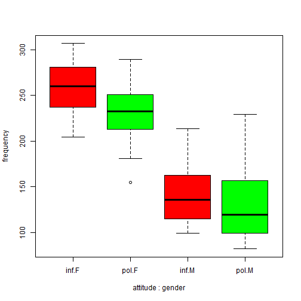

```r
# t test

# Two teaching methods and the scores in a language test.
metode <- read.csv("data/ttest2a.csv", dec=",")
attach(metode)

head(metode)
```

```
##   Testpersonen Resultat Methode
## 1            1       23       A
## 2            2       34       A
## 3            3       54       A
## 4            4       33       A
## 5            5       26       A
## 6            6       27       A
```

```r
tapply(Resultat, list(Methode), mean)
```

```
##     A     B 
## 32.65 31.55
```

```r
tapply(Resultat, list(Methode), sd)
```

```
##        A        B 
## 9.906271 7.897201
```

```r
barplot(tapply(Resultat, list(Methode), mean), col=c(3:2))
```



```r
# Do the means of the two samples differ significantly?
# Hypothesis H0: they don't (if p > 0.05.
# Hypothesis H1: they do (if p < 0.05.
t.test(Resultat ~ Methode, data=metode, paired = F, var.equal = T)
```

```
## 
## 	Two Sample t-test
## 
## data:  Resultat by Methode
## t = 0.3883, df = 38, p-value = 0.7
## alternative hypothesis: true difference in means is not equal to 0
## 95 percent confidence interval:
##  -4.634791  6.834791
## sample estimates:
## mean in group A mean in group B 
##           32.65           31.55
```

```r
# Check the same hypotheses with the linear regression method
# Since there is only one predictor ("Methode"), we obtain the same result as with the t-test.
# Since p > 0.05, the score means of the two methods do not differ significantly.
m <- lm(Resultat ~ Methode, data=metode)
summary(m)
```

```
## 
## Call:
## lm(formula = Resultat ~ Methode, data = metode)
## 
## Residuals:
##    Min     1Q Median     3Q    Max 
## -16.65  -6.65  -0.55   5.45  21.35 
## 
## Coefficients:
##             Estimate Std. Error t value Pr(>|t|)    
## (Intercept)   32.650      2.003  16.300   <2e-16 ***
## MethodeB      -1.100      2.833  -0.388      0.7    
## ---
## Signif. codes:  0 '***' 0.001 '**' 0.01 '*' 0.05 '.' 0.1 ' ' 1
## 
## Residual standard error: 8.958 on 38 degrees of freedom
## Multiple R-squared:  0.003952,	Adjusted R-squared:  -0.02226 
## F-statistic: 0.1508 on 1 and 38 DF,  p-value: 0.7
```

```r
library(effects)
```

```
## Loading required package: carData
```

```
## lattice theme set by effectsTheme()
## See ?effectsTheme for details.
```

```r
allEffects(m)
```

```
##  model: Resultat ~ Methode
## 
##  Methode effect
## Methode
##     A     B 
## 32.65 31.55
```

```r
plot(allEffects(m), multiline=TRUE, grid=TRUE, rug=FALSE, as.table=TRUE)
```


